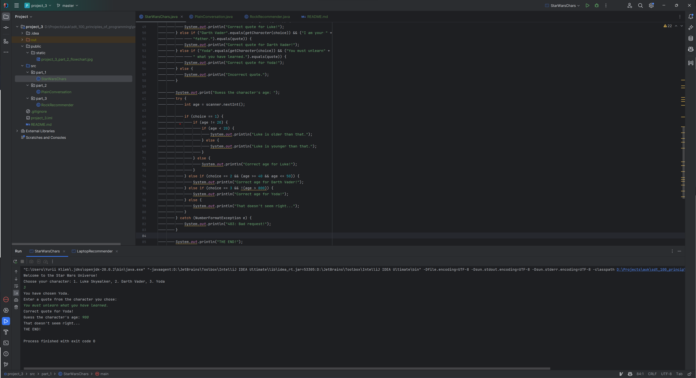

# UK SDT 100: Principles of Programming FA23: Project 3. If/else statements, switch

This project demonstrates various Java tasks related to conditional statements, user input processing, and basic conversations. The structure follows best practices for Java project organization, with each task housed in its specific package and relevant assets stored appropriately.

## Table of Contents

- [Setup](#setup)
- [Project Structure](#project-structure)
- [Running the Programs](#running-the-programs)
- [Tasks Overview](#tasks-overview)
- [Contributors](#contributors)

## Setup

1. **Clone the Repository**
    ```bash
    git clone <repository-link>
    ```

2. Navigate to the `auk_project_3` directory.

3. Open the project in your preferred Java IDE.

## Project Structure

<pre>
project_3
│
├── public
│   └── static
│       └── [screenshots and flowchart]
│
├── src
│   ├── part_1
│   │   └── StarWarsChars.java
│   │
│   ├── part_2
│   │   └── PlainConversation.java
│   │
│   └── part_3
│       └── RockRecommender.java
│
├── .gitignore
├── README.md
└── project_3.iml
</pre>

- **public/static:** Houses static assets like screenshots and flowcharts related to each task.

- **src:** The source directory contains all the Java code, structured into packages according to task parts.

## Running the Programs

1. Navigate to the desired package under the `src` directory.
2. Run the `main` method of the desired Java file.

## Tasks Overview

### Part 1: If/else and switch Syntax

- **File:** [StarWarsChars.java](src/part_1/StarWarsChars.java)



- Showcases control statements, relational operators, string comparisons, and logical operators within if conditions.

### Part 2: Plain conversation + Flowchart

- **File:** [PlainConversation.java](src/part_2/PlainConversation.java)


#### Flowchart


- Interactive program that inquires about the user's age and deduces their daily activity based on it.

### Part 3: Improved conversation

- **File:** [RockRecommender.java](src/part_3/RockRecommender.java)


- An advanced conversational program recommending rock bands based on user input.